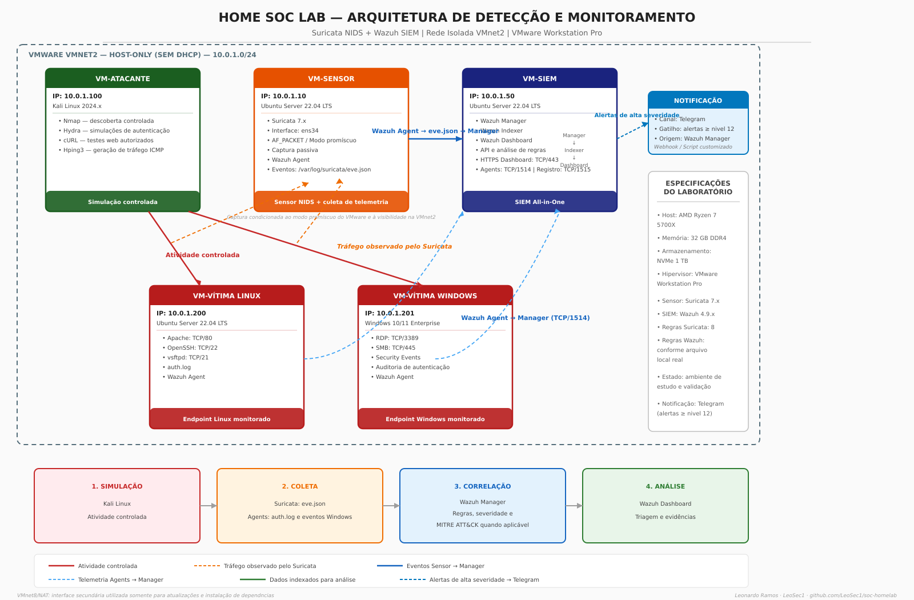

# Arquitetura do Laboratório

## Visão Geral

O laboratório é composto por 5 máquinas virtuais conectadas em uma rede isolada (`VMnet2` - `10.0.1.0/24`) dentro do VMware Workstation Pro.

A segmentação em máquinas separadas foi uma decisão de projeto para simular um cenário real onde o sensor IDS fica isolado dos servidores de produção, reduzindo a superfície de ataque e garantindo a integridade dos dados de telemetria.

---

## Diagrama da Arquitetura

<div align="center">



</div>

---

## Topologia e Fluxo de Dados

```text
ATACANTE (10.0.1.100) ──── ataque ─────► VÍTIMA LINUX (10.0.1.200)
         │                                        │
         └──── ataque ─────► VÍTIMA WINDOWS (10.0.1.201)
                                                   │
    SENSOR (10.0.1.10)                            │
    Suricata em modo promíscuo                    │
    Captura TODO o tráfego da rede                │
         │                                        │
         │ eve.json (alertas)        auth.log / Event IDs
         │                                        │
         └────────────────┬  ┌────────────────────┘
                          ▼  ▼
                    SIEM (10.0.1.50)
                    Wazuh All-in-One
                    Manager + Indexer + Dashboard
```

---

## Por que cada máquina é separada

* **VM-Sensor separada das Vítimas:**  
  O Suricata precisa ficar em uma máquina dedicada por dois motivos. Primeiro, ele opera em modo promíscuo com `AF_PACKET` para inspecionar passivamente o tráfego de todo o segmento de rede. Segundo, caso um invasor comprometa o servidor alvo, o sensor permanece íntegro e continua gerando telemetria forense.

* **VM-SIEM separada do Sensor:**  
  O stack Wazuh (Manager, Indexer OpenSearch e Dashboard) consome recursos consideráveis de CPU e memória. Centralizá-los em uma VM exclusiva previne gargalos operacionais e perda de pacotes (*packet drops*) no sensor durante picos de tráfego.

* **Duas Vítimas Heterogêneas (Linux + Windows):**  
  Demonstra a capacidade do SIEM de correlacionar eventos de ambientes mistos. No mercado corporativo, servidores Linux e estações de trabalho Windows coexistem, demandando regras e decodificadores específicos para cada sistema.

---

## Segmentação de Rede

| Interface VMware | Tipo | Endereçamento | Função |
|---|---|---|---|
| **VMnet8** | NAT | DHCP | Conectividade de Internet (apenas para provisionamento e downloads) |
| **VMnet2** | Host-Only | `10.0.1.0/24` | Rede privativa do laboratório (tráfego de ataque, monitoramento e telemetria) |

> **Nota de Segurança:** As interfaces ligadas à `VMnet8` devem ser desconectadas ou desativadas durante a execução de testes ofensivos para assegurar confinamento absoluto do tráfego.

---

## Especificações das Máquinas Virtuais

| Máquina | Sistema Operacional | RAM | vCPUs | Disco | Serviços e Papel |
|---|---|:---:|:---:|:---:|---|
| **VM-SIEM** | Ubuntu Server 22.04 LTS | 8 GB | 4 | 50 GB | Wazuh All-in-One (Manager, Indexer, Dashboard) |
| **VM-Sensor** | Ubuntu Server 22.04 LTS | 4 GB | 2 | 30 GB | Suricata 7.x NIDS em modo promíscuo + Agente Wazuh |
| **VM-Vítima Linux** | Ubuntu Server 22.04 LTS | 2 GB | 2 | 20 GB | Apache (80), OpenSSH (22), vsftpd (21) + Agente Wazuh |
| **VM-Vítima Windows** | Windows 10/11 Enterprise | 4 GB | 2 | 40 GB | RDP (3389), SMB (445), Event Viewer + Agente Wazuh |
| **VM-Atacante** | Kali Linux 2024 | 4 GB | 2 | 25 GB | Plataforma ofensiva (Nmap, Hydra, Hping3, cURL) |

---

## Hardware do Host Físico

* **Processador:** AMD Ryzen 7 5700X (8 cores / 16 threads)
* **Memória RAM:** 32 GB DDR4
* **Armazenamento:** SSD NVMe 1 TB
* **Hipervisor:** VMware Workstation Pro
* **Alocação de Memória:** 22 GB dedicados às VMs (reservando 10 GB para o sistema operacional host)
