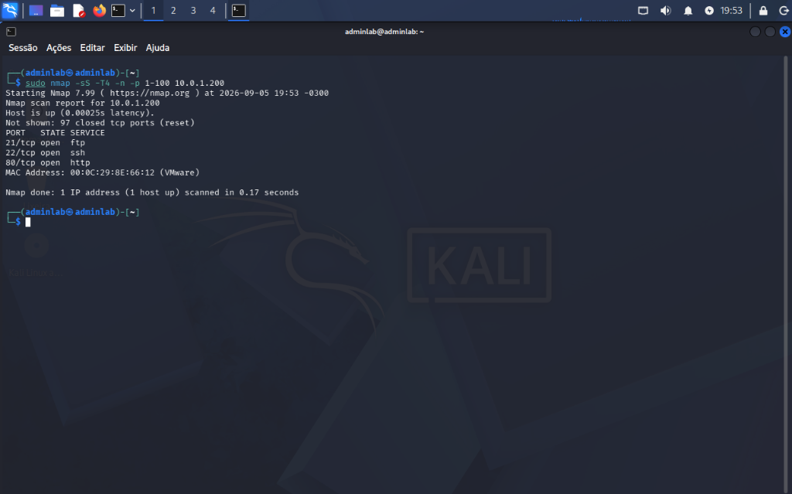
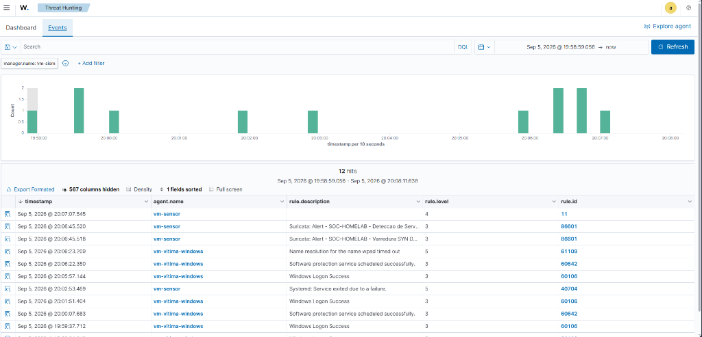

# Relatório de Teste: TST-01 — Varredura SYN de Portas (Nmap)

## 1. Informações Básicas

* **ID do Cenário:** `TST-01`
* **Data da Execução:** 05/09/2026
* **Ambiente:** Rede Isolada `10.0.1.0/24` (VMware VMnet2 Host-Only)
* **Objetivo:** Validar a capacidade do Suricata NIDS e do Wazuh SIEM de identificar varreduras de portas furtivas (TCP SYN Scan) que ultrapassem o limiar estabelecido de conexões anômalas por segundo.

---

## 2. Mapeamento MITRE ATT&CK

* **Tática:** Reconhecimento / Descoberta (`TA0043` / `TA0007`)
* **Técnica:** `T1046` — Network Service Discovery
* **Justificativa:** O atacante envia sucessivos pacotes de sondagem para identificar portas abertas e serviços ativos na rede antes de tentar a exploração.

---

## 3. Topologia e Parâmetros

* **IP Atacante (Kali Linux):** `10.0.1.100` (porta de origem efêmera)
* **IP Alvo / Sensor:** `10.0.1.10` (`VM-Sensor`)
* **Portas Alvo:** `1-100/TCP`
* **Ferramenta Utilizada:** `nmap` v7.99

---

## 4. Regras de Detecção Envolvidas

### Suricata NIDS
```text
alert tcp any any -> $HOME_NET any (
    msg:"SOC-HOMELAB - Varredura SYN Detectada";
    flags:S,12;
    threshold:type both, track by_src, count 20, seconds 5;
    classtype:attempted-recon;
    sid:1000001; rev:1;
)
```

### Wazuh SIEM
* **Rule Base:** `86601` (Decodificação automática do evento Suricata `eve.json`).
* **Rule Customizada:** `100010` (Correlação para assinatura SID 1000001 com severidade Nível 8).

---

## 5. Evidências Coletadas

### 5.1 Execução Ofensiva no Kali Linux
O comando executado enviou 100 pacotes SYN em 0.17 segundos, ultrapassando com sucesso o threshold da regra (mínimo de 20 pacotes em 5 segundos):

```bash
sudo nmap -sS -T4 -n -p 1-100 10.0.1.10
```



### 5.2 Alerta Capturado no Suricata (`eve.json`)
```json
{
  "timestamp": "2026-09-05T20:06:45.140351-0300",
  "flow_id": 1481590634698141,
  "in_iface": "ens34",
  "event_type": "alert",
  "src_ip": "10.0.1.135",
  "src_port": 61857,
  "dest_ip": "10.0.1.10",
  "dest_port": 38,
  "proto": "TCP",
  "alert": {
    "action": "allowed",
    "gid": 1,
    "signature_id": 1000001,
    "rev": 1,
    "signature": "SOC-HOMELAB - Varredura SYN Detectada",
    "category": "Attempted Information Leak",
    "severity": 2
  }
}
```

### 5.3 Detecção no Wazuh Dashboard
O Wazuh Agent ingeriu o arquivo `eve.json` e encaminhou o alerta ao Wazuh Indexer/Dashboard, onde foi indexado com sucesso:



---

## 6. Resultados e Análise Técnica

| Métrica | Valor Obtido |
|---|---|
| **Resultado Esperado** | Detecção da varredura SYN e alerta categorizado como Reconhecimento |
| **Resultado Observado** | Alerta gerado pelo Suricata (`SID 1000001`) e ingerido pelo SIEM |
| **Tempo de Detecção** | Quase em tempo real (< 1 segundo após término do scan) |
| **Falsos Positivos** | Nenhum (o threshold de 20 SYNs / 5s evita ruídos de conexões normais) |

### Conclusão e Próximos Passos
O teste comprovou a eficácia da regra de threshold no motor Suricata 7.x e o funcionamento do pipeline de ingestão via Wazuh Agent. O próximo passo do laboratório é validar o teste de força bruta via SSH (`TST-02`) com a ferramenta Hydra.
