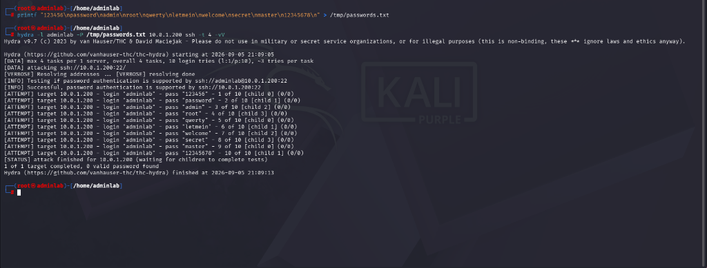
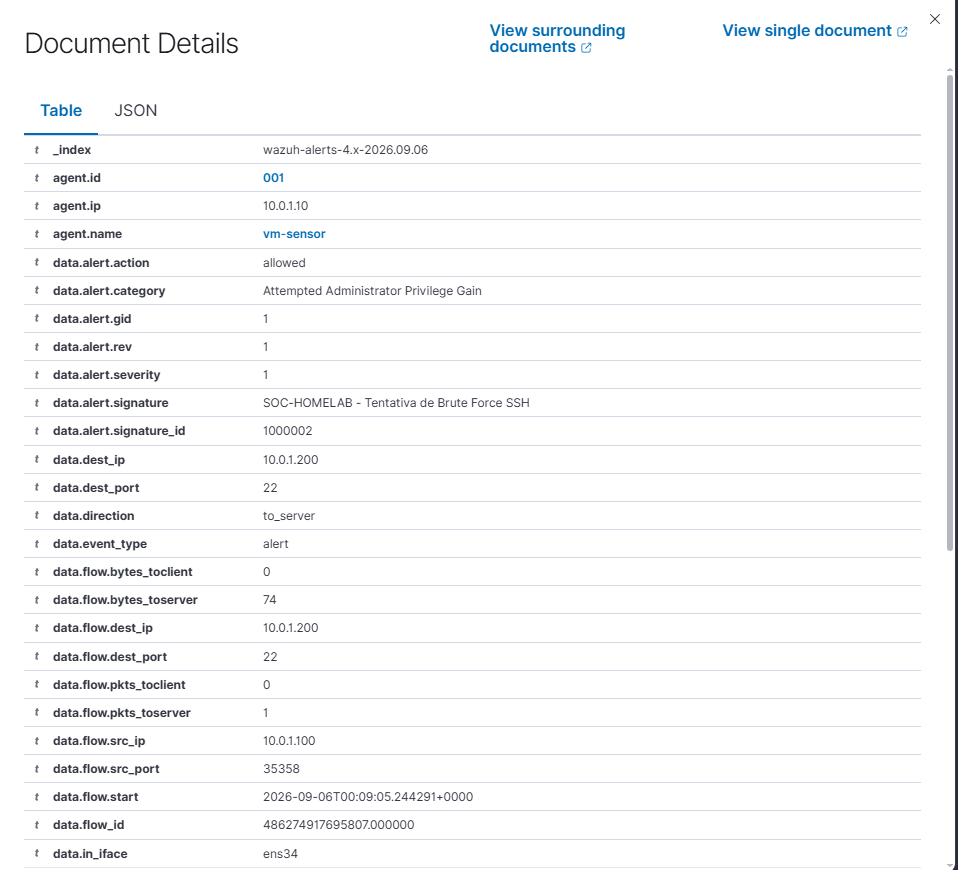

# Relatório de Teste: TST-02 — Força Bruta SSH (Hydra)

## 1. Informações Básicas

* **ID do Cenário:** `TST-02`
* **Data da Execução:** 05/09/2026
* **Ambiente:** Rede Isolada `10.0.1.0/24` (VMware VMnet2 Host-Only)
* **Objetivo:** Validar a capacidade de detecção de tentativas sistemáticas de autenticação não autorizada contra o serviço SSH (`22/TCP`) da máquina vítima, tanto em nível de rede (Suricata NIDS) quanto em nível de host (Wazuh SIEM).

---

## 2. Mapeamento MITRE ATT&CK

* **Tática:** Acesso Inicial / Credenciais (`TA0001` / `TA0006`)
* **Técnica:** `T1110` — Brute Force (`T1110.001` - Password Guessing)
* **Justificativa:** O atacante tenta autenticar repetidamente com diferentes senhas para um usuário específico visando obter acesso administrativo via SSH.

---

## 3. Topologia e Parâmetros

* **IP Atacante (Kali Linux):** `10.0.1.100`
* **IP Alvo (Vítima Linux):** `10.0.1.200`
* **Sensor em Modo Promíscuo:** `10.0.1.10` (`VM-Sensor` via `ens34`)
* **Serviço Alvo:** SSH (`22/TCP`)
* **Usuário Alvo:** `adminlab`
* **Ferramenta Utilizada:** `hydra` v9.7

---

## 4. Regras de Detecção Envolvidas

### Suricata NIDS (Rede)
```text
alert ssh any any -> $HOME_NET 22 (
    msg:"SOC-HOMELAB - Tentativa de Brute Force SSH";
    threshold:type both, track by_src, count 5, seconds 60;
    classtype:attempted-admin;
    sid:1000002; rev:1;
)
```

### Wazuh SIEM (Host e Correlação)
* **Rule Base (Suricata):** `86601` (Alerta do Suricata recebido e indexado).
* **Rule Customizada SIEM:** `100020` (Severidade Nível 10 - Brute-force SSH detectado pelo Suricata).
* **Regras Nativas HIDS:** `5710` (`sshd: Attempt to login using a non-existent user`) e `5716` (`sshd: authentication failed`).

---

## 5. Evidências Coletadas

### 5.1 Execução Ofensiva no Kali Linux
O atacante executou tentativas de autenticação com wordlist contra o serviço SSH da vítima:

```bash
hydra -l adminlab -P /tmp/passwords.txt 10.0.1.200 ssh -t 4 -vV
```



### 5.2 Alerta Capturado no Suricata (`eve.json`)
O Suricata no sensor promíscuo identificou o padrão de conexão repetitiva e gerou o alerta com severidade administrativa:

```json
{
  "timestamp": "2026-09-06T00:09:05.244291+0000",
  "flow_id": 486274917695807,
  "in_iface": "ens34",
  "event_type": "alert",
  "src_ip": "10.0.1.100",
  "src_port": 35358,
  "dest_ip": "10.0.1.200",
  "dest_port": 22,
  "proto": "TCP",
  "alert": {
    "action": "allowed",
    "gid": 1,
    "signature_id": 1000002,
    "rev": 1,
    "signature": "SOC-HOMELAB - Tentativa de Brute Force SSH",
    "category": "Attempted Administrator Privilege Gain",
    "severity": 1
  }
}
```

### 5.3 Detecção no Wazuh Dashboard
O alerta do Suricata foi recebido via Wazuh Agent da VM-Sensor e centralizado no SIEM com todos os metadados da conexão:



---

## 6. Resultados e Análise Técnica

| Métrica | Valor Obtido |
|---|---|
| **Resultado Esperado** | Detecção das múltiplas tentativas de autenticação SSH e emissão de alerta de alta prioridade |
| **Resultado Observado** | Regra `1000002` do Suricata acionada com sucesso ao ultrapassar o limiar de conexões |
| **Severidade** | Alta (`Attempted Administrator Privilege Gain`) |
| **Falsos Positivos** | Controlados pelo threshold (requer mais de 5 tentativas em 60 segundos) |

### Conclusão e Próximos Passos
O teste demonstrou a eficiência da detecção em profundidade: enquanto o tráfego SSH é criptografado, o comportamento anômalo da taxa de abertura de sessões permitiu ao NIDS identificar a técnica antes mesmo de qualquer credencial ser comprometida. O próximo teste do ciclo será a simulação de DoS e tráfego ICMP anômalo (`TST-03`).
