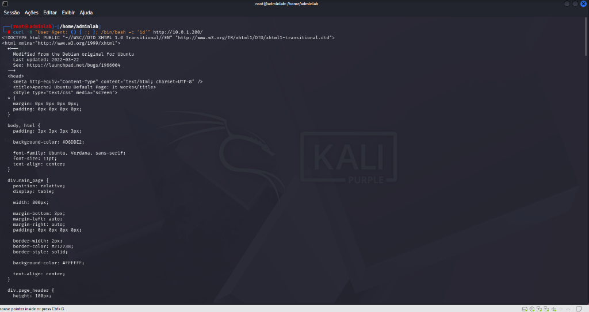
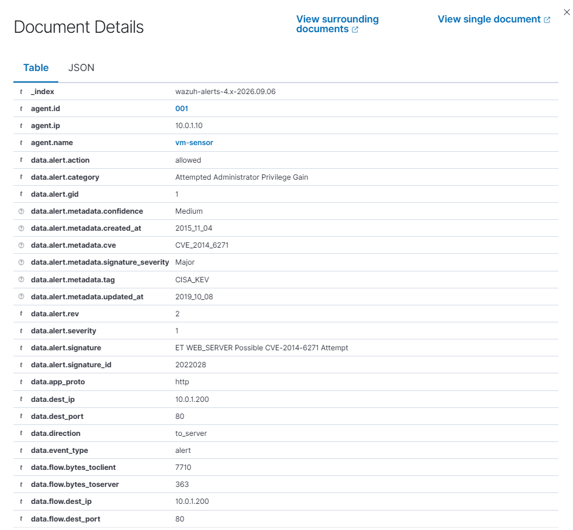
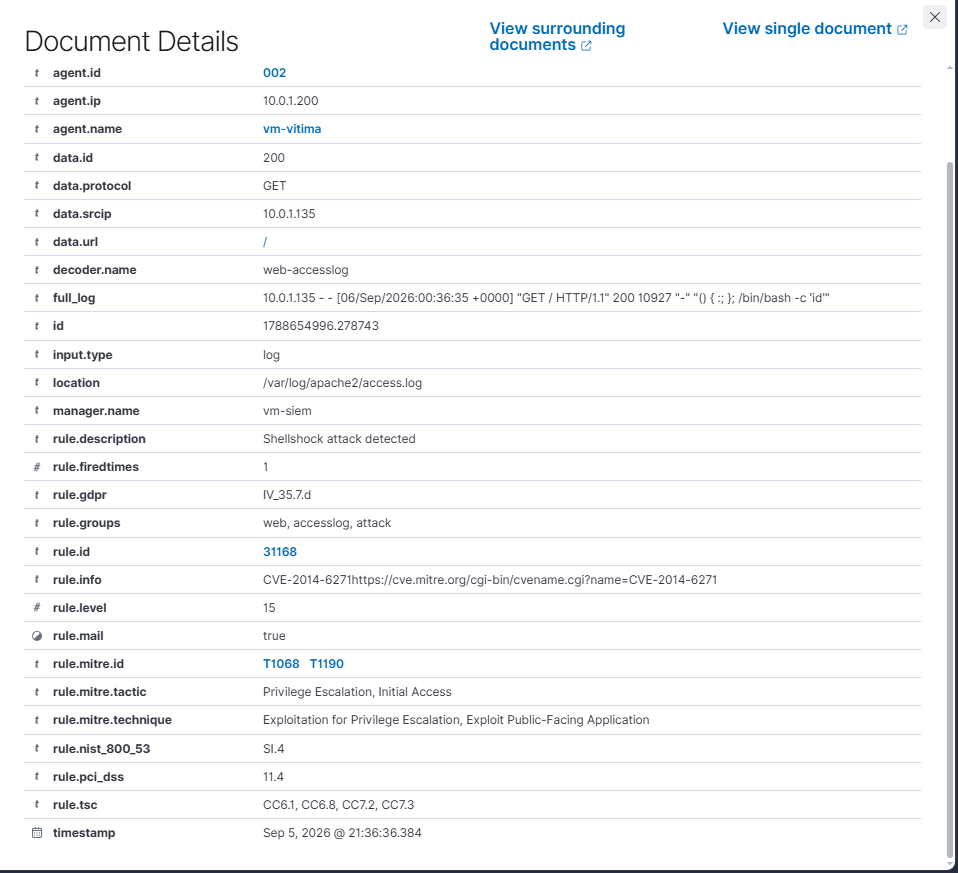
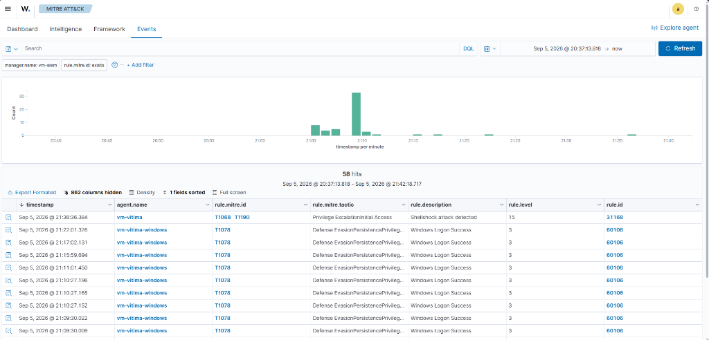

# Relatório de Teste: TST-03 — Exploração Web: Shellshock via HTTP (cURL)

## 1. Informações Básicas

* **ID do Cenário:** `TST-03`
* **Data da Execução:** 05/09/2026
* **Ambiente:** Rede Isolada `10.0.1.0/24` (VMware VMnet2 Host-Only)
* **Objetivo:** Validar a eficácia da detecção em duas camadas (Defesa em Profundidade) contra tentativas de exploração web da vulnerabilidade Shellshock (CVE-2014-6271), operando tanto na Camada de Aplicação de Rede (Suricata NIDS L7) quanto no Host (Wazuh HIDS via logs de acesso do Apache).

---

## 2. Mapeamento MITRE ATT&CK

* **Tática:** Acesso Inicial / Escalação de Privilégios (`TA0001` / `TA0004`)
* **Técnica Principal:** `T1190` — Exploit Public-Facing Application
* **Técnica Secundária:** `T1068` — Exploitation for Privilege Escalation
* **Vulnerabilidade Associada:** `CVE-2014-6271` (CISA Known Exploited Vulnerability - KEV)
* **Justificativa:** O atacante tenta injetar comandos de sistema arbitrários no interpretador Bash através de variáveis de ambiente passadas por cabeçalhos HTTP normais (`User-Agent`).

---

## 3. Topologia e Parâmetros

* **IP Atacante (Kali Linux):** `10.0.1.100` / `10.0.1.135`
* **IP Alvo (Vítima Linux):** `10.0.1.200` (`VM-Vítima`)
* **Sensor em Modo Promíscuo:** `10.0.1.10` (`VM-Sensor` via `ens34`)
* **Serviço Alvo:** Apache HTTP Server (`80/TCP`)
* **Vetor de Injeção:** Cabeçalho HTTP `User-Agent` contendo a sequência `() { :; };`
* **Ferramenta Utilizada:** `curl` v8.x

---

## 4. Regras de Detecção Envolvidas

### 4.1 Camada de Rede: Suricata NIDS (L7 HTTP)
```text
alert http any any -> $HOME_NET any (
    msg:"SOC-HOMELAB - Tentativa de Shellshock";
    content:"() {"; http_header;
    classtype:web-application-attack;
    sid:1000005; rev:1;
)
```
* **Assinatura Global da Comunidade (ET Open):** `SID 2022028` (`ET WEB_SERVER Possible CVE-2014-6271 Attempt`) com tags automáticas de inteligência de ameaças (`CVE_2014_6271`, `CISA_KEV`).

### 4.2 Camada de Host: Wazuh SIEM / HIDS
* **Regra Nativa do Apache:** `Rule ID 31168` — `Shellshock attack detected` (Severidade Nível 15 - Crítico, mapeada para `T1068` e `T1190`).
* **Regra de Correlação Customizada do Sensor:** `Rule ID 100050` — `SOC-HOMELAB: Tentativa de exploit Shellshock via HTTP` (Severidade Nível 14, mapeada para `T1190`).

---

## 5. Evidências Coletadas

### 5.1 Execução Ofensiva no Kali Linux
O atacante realizou a requisição HTTP injetando a carga de prova de conceito no cabeçalho:

```bash
curl -H "User-Agent: () { :; }; /bin/bash -c 'id'" http://10.0.1.200/
```



### 5.2 Detecção na Rede via Suricata NIDS (VM-Sensor)
O Suricata interceptou o pacote HTTP na interface promíscua `ens34`, inspecionou o payload L7 e gerou o alerta enriquecido com metadados CVE:

```json
{
  "timestamp": "2026-09-06T00:36:36.612265+0000",
  "in_iface": "ens34",
  "event_type": "alert",
  "src_ip": "10.0.1.135",
  "dest_ip": "10.0.1.200",
  "dest_port": 80,
  "app_proto": "http",
  "alert": {
    "signature_id": 2022028,
    "signature": "ET WEB_SERVER Possible CVE-2014-6271 Attempt",
    "metadata": {
      "cve": "CVE_2014_6271",
      "tag": "CISA_KEV"
    }
  }
}
```



### 5.3 Detecção no Host via Wazuh HIDS (VM-Vítima)
O agente Wazuh na máquina alvo leu `/var/log/apache2/access.log`, identificou a injeção no cabeçalho e disparou alerta de severidade máxima:



### 5.4 Mapeamento no Painel MITRE ATT&CK
O SIEM consolidou o evento e mapeou diretamente na matriz MITRE sob as táticas de *Initial Access* e *Privilege Escalation*:



---

## 6. Resultados e Análise Técnica

| Métrica | Valor Obtido |
|---|---|
| **Resultado Esperado** | Detecção da injeção maliciosa em nível de rede antes de processamento e registro em log do host |
| **Resultado Observado** | Detecção dupla e simultânea: Suricata (L7 HTTP) + Apache HIDS (Nível 15) |
| **Severidade Registrada** | Nível 15 (Máxima do Wazuh SIEM) |
| **Técnicas MITRE Validadas** | `T1190` (Exploit Public-Facing App) e `T1068` (Privilege Escalation) |

### Conclusão e Próximos Passos
O teste comprovou a arquitetura de **Defesa em Profundidade**: mesmo se a vítima não possuísse agente local, o Suricata teria gerado o alerta na rede; reciprocamente, o agente do host confirmou a recepção da requisição no log do servidor web. O próximo cenário do laboratório envolverá a validação de força bruta contra o serviço de Desktop Remoto (RDP) no Windows (`TST-04`).
