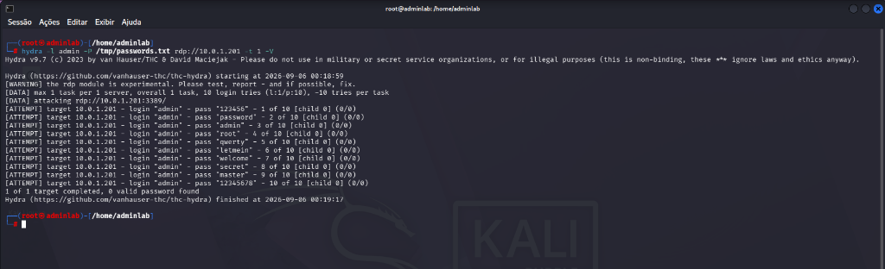
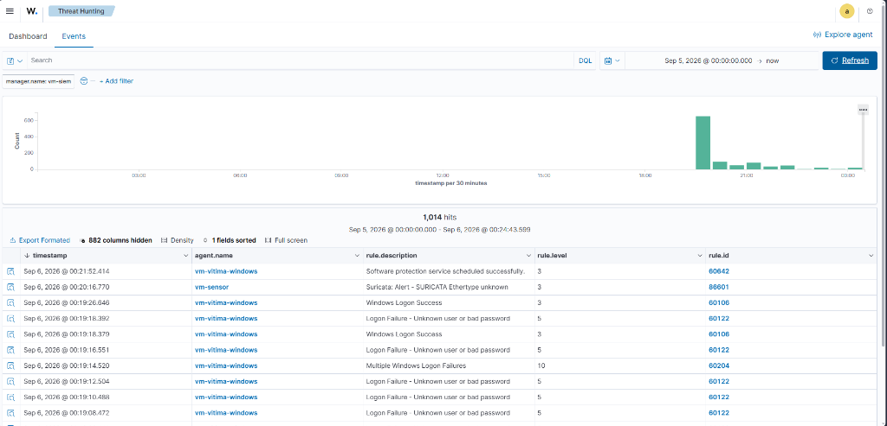
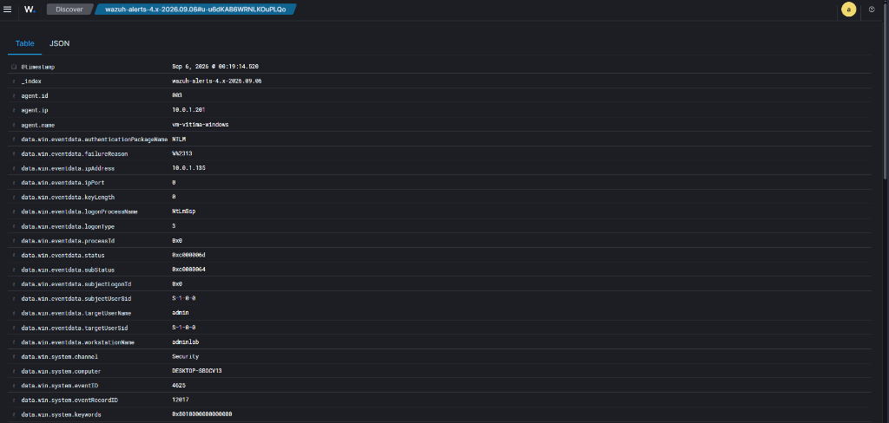
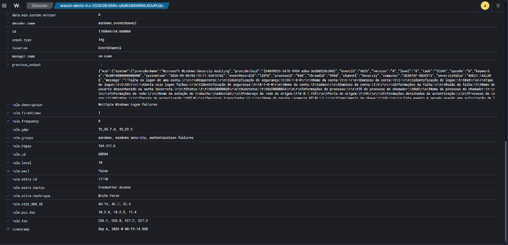

# Relatório de Teste: TST-04 — Força Bruta RDP no Windows 10 (Hydra)

## 1. Informações Básicas

* **ID do Cenário:** `TST-04`
* **Data da Execução:** 06/09/2026
* **Ambiente:** Rede Isolada `10.0.1.0/24` (VMware VMnet2 Host-Only)
* **Objetivo:** Validar a capacidade de detecção de ataques de adivinhação sistemática de credenciais (Password Guessing) contra o protocolo de Área de Trabalho Remota (RDP / `3389/TCP`) em endpoint Windows 10 Enterprise, auditando o canal de eventos de segurança (`Security.evtx` - Event ID 4625) através do agente Wazuh (HIDS).

---

## 2. Mapeamento MITRE ATT&CK

* **Tática:** Acesso a Credenciais (`TA0006`)
* **Técnica Principal:** `T1110` — Brute Force
* **Subtécnica:** `T1110.001` — Password Guessing
* **Conformidade Normativa:** PCI-DSS v3.2.1 (Requisitos 10.2.4, 10.2.5) e NIST SP 800-53 Rev. 5 (Controles AC-7, SI-4)
* **Justificativa:** O atacante tenta autenticar repetidamente via rede em sessão RDP com dicionário de senhas comuns para a conta `admin`.

---

## 3. Topologia e Parâmetros

* **IP Atacante (Kali Linux):** `10.0.1.100` / `10.0.1.135`
* **IP Alvo (Vítima Windows):** `10.0.1.201` (`VM-Vítima Windows` / Windows 10 Pro)
* **Serviço Alvo:** RDP (`3389/TCP` - TermService)
* **Usuário Alvo:** `admin`
* **Tipo de Logon Windows:** `LogonType 3` (Network Logon)
* **Ferramenta Utilizada:** `hydra` v9.7

---

## 4. Regras de Detecção Envolvidas

### Wazuh HIDS (Windows Security Event Channel)
* **Regra Base (Falha Individual):** `Rule ID 60122` — `Logon Failure - Unknown user or bad password` (Severidade Nível 5, decorrente do Event ID 4625).
* **Regra de Correlação (Força Bruta):** `Rule ID 60204` — `Multiple Windows Logon Failures` (Severidade Nível 10 - Alta, acionada ao atingir a frequência de tentativas consecutivas com falha).

---

## 5. Evidências Coletadas

### 5.1 Execução Ofensiva no Kali Linux
O atacante realizou 10 tentativas sequenciais de autenticação RDP com wordlist contra a porta 3389 da máquina Windows:

```bash
hydra -l admin -P /tmp/passwords.txt rdp://10.0.1.201 -t 1 -V
```



### 5.2 Alertas Individuais e Correlação no Wazuh Dashboard
A sequência de falhas gerou múltiplos alertas da Rule 60122 e culminou na correlação de força bruta (Rule 60204, Nível 10):



### 5.3 Metadados Forenses do Evento Windows (Event ID 4625)
O agente Wazuh extraiu os dados estruturados do subsistema de segurança da Microsoft:

```json
{
  "win": {
    "system": {
      "providerName": "Microsoft-Windows-Security-Auditing",
      "eventID": "4625",
      "channel": "Security",
      "computer": "DESKTOP-SBOCV13",
      "severityValue": "AUDIT_FAILURE"
    },
    "eventdata": {
      "targetUserName": "admin",
      "ipAddress": "10.0.1.135",
      "logonType": "3",
      "logonProcessName": "NtLmSsp",
      "status": "0xc000006d",
      "subStatus": "0xc0000064"
    }
  }
}
```



### 5.4 Mapeamento MITRE ATT&CK e Frameworks
O evento correlacionado registrou a tática de *Credential Access* e a técnica *Brute Force* com os controles normativos associados:



---

## 6. Resultados e Análise Técnica

| Métrica | Valor Obtido |
|---|---|
| **Resultado Esperado** | Identificação das tentativas de logon inválido no Windows e correlação em alerta de força bruta |
| **Resultado Observado** | Geração do Event ID 4625 na vítima e acionamento da regra `60204` (Nível 10) no SIEM |
| **Severidade Registrada** | Nível 10 (Alta) |
| **Identificação Forense** | Usuário atacado (`admin`), IP de origem (`10.0.1.135`), Protocolo (`NtLmSsp`) |
| **Técnica MITRE Validada** | `T1110.001` (Password Guessing) |

### Conclusão e Próximos Passos
O teste demonstrou a importância vital do HIDS em endpoints com tráfego criptografado (como RDP/TLS): enquanto o NIDS no cabo de rede enxerga apenas pacotes TLS genéricos, o agente de host inspeciona os eventos do kernel do Windows e registra a tentativa de invasão com os metadados do atacante. O próximo cenário do laboratório validará o tráfego ICMP anômalo com carga elevada (`TST-06`).
