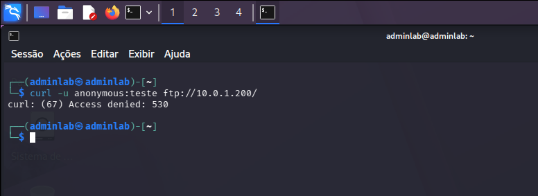
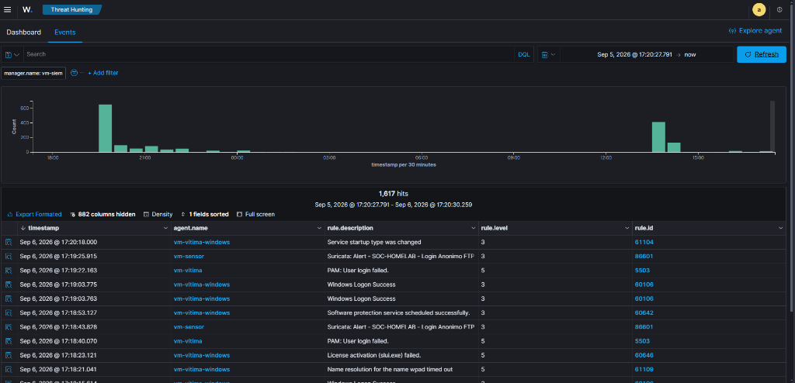
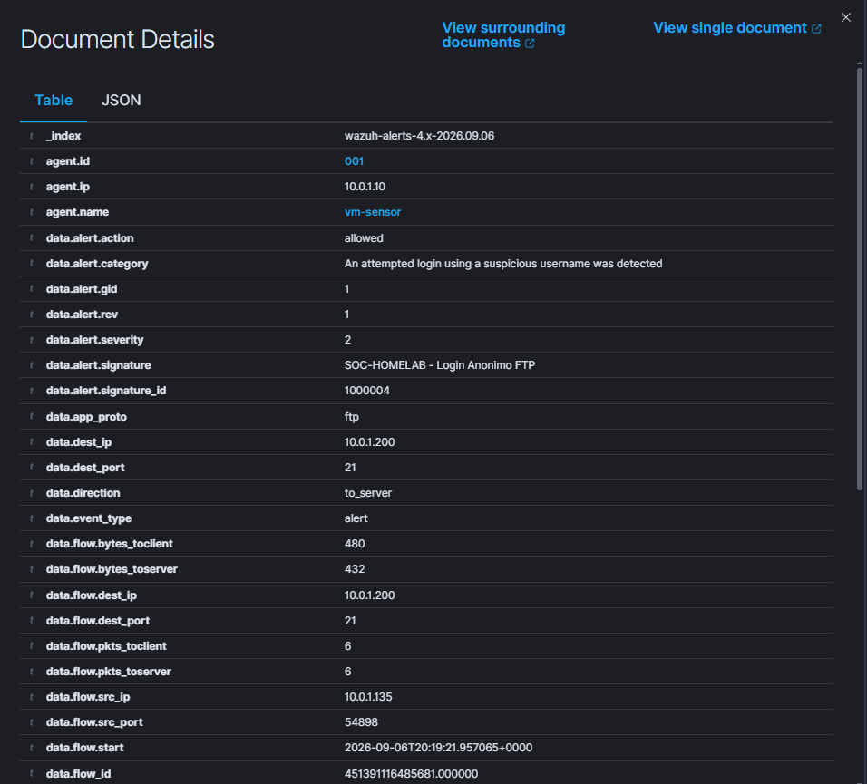
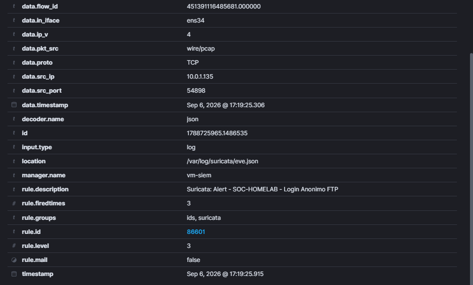

# Relatório de Teste: TST-05 — Autenticação FTP Anônima (cURL / FTP)

## 1. Informações Básicas

* **ID do Cenário:** `TST-05`
* **Data da Execução:** 06/09/2026
* **Ambiente:** Rede Isolada `10.0.1.0/24` (VMware VMnet2 Host-Only)
* **Objetivo:** Validar a capacidade de inspeção em Camada de Aplicação (L7) do Suricata NIDS na identificação de tentativas de autenticação não autorizadas utilizando a conta especial `anonymous` no protocolo FTP (`21/TCP`), além de registrar a correlação de falha de autenticação no agente Wazuh da máquina alvo.

---

## 2. Contexto de Segurança e Risco

* **Classificação de Risco:** Violação de Política de Segurança (*Policy Violation*) / Falha de Configuração (*Security Misconfiguration*)
* **Conformidade Normativa:** PCI-DSS v3.2.1 (Requisito 2.1 - Remoção de senhas e contas padrão/anônimas) e CIS Ubuntu Linux Benchmark
* **Justificativa:** O acesso anônimo ao serviço FTP permite que invasores sem credenciais válidas obtenham listagens de diretórios, baixem arquivos confidenciais ou utilizem o servidor como repositório intermediário de malwares (*Dropper*).

---

## 3. Topologia e Parâmetros

* **IP Atacante (Kali Linux):** `10.0.1.100` / `10.0.1.135`
* **IP Alvo (Vítima Linux):** `10.0.1.200` (`VM-Vítima`)
* **Sensor em Modo Promíscuo:** `10.0.1.10` (`VM-Sensor` via `ens34`)
* **Serviço Alvo:** vsftpd (`21/TCP`)
* **Usuário Testado:** `anonymous`
* **Ferramenta Utilizada:** `curl` v8.x (negociação do protocolo FTP)

---

## 4. Regras de Detecção Envolvidas

### 4.1 Camada de Rede: Suricata NIDS (Inspeção L7 FTP)
```text
alert ftp any any -> $HOME_NET 21 (
    msg:"SOC-HOMELAB - Login Anonimo FTP";
    content:"anonymous"; nocase;
    classtype:policy-violation;
    sid:1000004; rev:1;
)
```
* **Decodificação de Aplicação:** O Suricata disseca a sequência de comandos FTP e avalia o parâmetro `USER anonymous` mesmo que a conexão trafegue em portas não convencionais se o protocolo for decodificado como FTP.

### 4.2 Camada de Host: Wazuh HIDS (VM-Vítima)
* **Regra de Falha de Login:** `Rule ID 5503` — `PAM: User login failed` (Severidade Nível 5 no host).
* **Ingestão no SIEM:** `Rule ID 86601` — `Suricata: Alert - SOC-HOMELAB - Login Anonimo FTP` (Classificação: `An attempted login using a suspicious username was detected`).

---

## 5. Evidências Coletadas

### 5.1 Execução Ofensiva no Kali Linux
O atacante tentou estabelecer uma sessão FTP informando credenciais anônimas:

```bash
curl -u anonymous:teste ftp://10.0.1.200/
```

O servidor respondeu com código de recusa `530 Access denied`:



### 5.2 Alerta e Linha do Tempo no Wazuh Dashboard
A tentativa gerou alerta simultâneo no sensor de rede (NIDS) e na vítima (HIDS):



### 5.3 Metadados Forenses da Camada 7 (Document Details)
O Suricata decodificou a aplicação como `ftp` e registrou a tentativa na porta 21:

```json
{
  "timestamp": "2026-09-06T17:19:25.915-0300",
  "in_iface": "ens34",
  "event_type": "alert",
  "src_ip": "10.0.1.135",
  "dest_ip": "10.0.1.200",
  "dest_port": 21,
  "app_proto": "ftp",
  "alert": {
    "action": "allowed",
    "signature_id": 1000004,
    "signature": "SOC-HOMELAB - Login Anonimo FTP",
    "category": "An attempted login using a suspicious username was detected",
    "severity": 2
  }
}
```




---

## 6. Resultados e Análise Técnica

| Métrica | Valor Obtido |
|---|---|
| **Resultado Esperado** | Detecção L7 do comando `USER anonymous` e alerta categorizado como violação de política |
| **Resultado Observado** | Regra `1000004` acionada com sucesso pelo Suricata e falha registrada pelo PAM na vítima |
| **Eficácia de Detecção** | Identificação do protocolo (`app_proto: ftp`), portas e credencial tentada |
| **Severidade** | Média (Política de Segurança) no NIDS; Nível 5 no HIDS |

### Conclusão do Ciclo de Validações
Com a conclusão bem-sucedida do cenário TST-05, todos os 6 cenários planejados para o ciclo inicial do SOC Homelab foram validados com evidências reais e completas de ponta a ponta (Rede + Host + SIEM).
