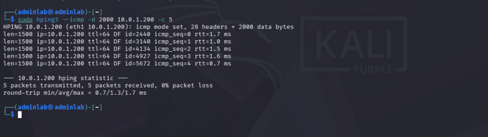
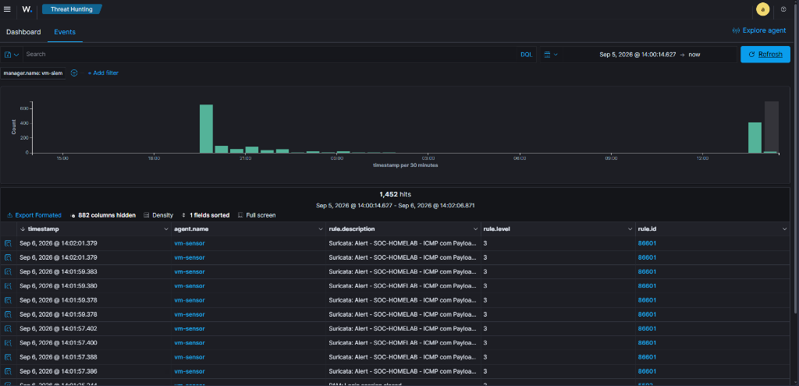
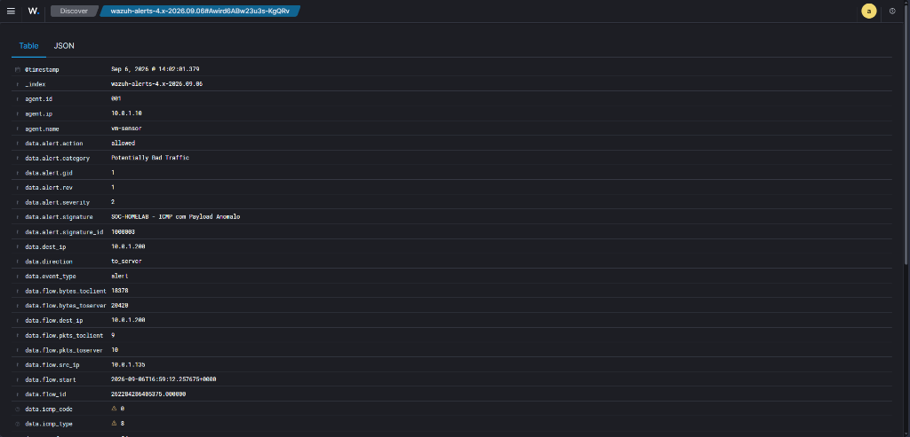
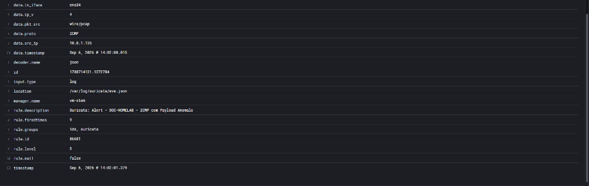

# Relatório de Teste: TST-06 — Tráfego ICMP com Carga Anômala (Hping3)

## 1. Informações Básicas

* **ID do Cenário:** `TST-06`
* **Data da Execução:** 06/09/2026
* **Ambiente:** Rede Isolada `10.0.1.0/24` (VMware VMnet2 Host-Only)
* **Objetivo:** Validar a capacidade do Suricata NIDS de realizar Inspeção Profunda de Pacotes (DPI) na Camada de Rede (Camada 3), identificando anomalias volumétricas de carga útil (payloads superiores a 1.000 bytes) que caracterizam técnicas de tunelamento encoberto (ICMP Tunneling), canais de Comando e Controle (C2) ou exfiltração não autorizada de dados.

---

## 2. Mapeamento MITRE ATT&CK

* **Tática:** Comando e Controle / Exfiltração (`TA0011` / `TA0010`)
* **Técnica Principal:** `T1095` — Non-Application Layer Protocol
* **Técnica Secundária:** `T1572` — Protocol Tunneling
* **Justificativa:** Ameaças avançadas utilizam o campo de dados do protocolo ICMP (Echo Request) para transportar tráfego malicioso e contornar firewalls perimetrais que inspecionam apenas portas TCP/UDP.

---

## 3. Topologia e Parâmetros

* **IP Atacante (Kali Linux):** `10.0.1.100` / `10.0.1.135`
* **IP Alvo (Vítima Linux):** `10.0.1.200` (`VM-Vítima`)
* **Sensor em Modo Promíscuo:** `10.0.1.10` (`VM-Sensor` via `ens34`)
* **Protocolo:** ICMP (Type 8 - Echo Request / Type 0 - Echo Reply)
* **Carga Útil Injetada (Payload):** 2.000 bytes por pacote
* **Volume Transmitido:** 5 pacotes sequenciais
* **Ferramenta Utilizada:** `hping3`

---

## 4. Regras de Detecção Envolvidas

### Suricata NIDS (Inspeção L3 / DPI)
```text
alert icmp any any -> $HOME_NET any (msg:"SOC-HOMELAB - ICMP com Payload Anomalo"; dsize:>1000; classtype:bad-unknown; sid:1000003; rev:1;)
```
* **Mecanismo:** A diretiva `dsize:>1000` avalia o tamanho da carga líquida do pacote, ignorando cabeçalhos IP/ICMP. Pacotes de diagnóstico legítimos (ping padrão de 32 a 64 bytes) não acionam a regra, eliminando falsos positivos.

### Wazuh SIEM (Ingestão e Correlação)
* **Decodificador:** `json` (leitura em tempo real do arquivo `/var/log/suricata/eve.json`).
* **Rule Base:** `Rule ID 86601` — `Suricata: Alert - SOC-HOMELAB - ICMP com Payload Anomalo`.
* **Classificação:** `Potentially Bad Traffic` / Severidade Nível 3 no SIEM (Nível 2 no Suricata).

---

## 5. Evidências Coletadas

### 5.1 Execução Ofensiva no Kali Linux
O atacante utilizou o utilitário `hping3` para forjar 5 requisições ICMP com carga útil de 2.000 bytes direcionadas ao servidor web da vítima:

```bash
sudo hping3 --icmp -d 2000 10.0.1.200 -c 5
```



### 5.2 Rajada de Alertas no Wazuh Dashboard (Visão Geral)
A sequência de pacotes gerou múltiplos alertas simultâneos no SIEM para cada frame capturado em modo promíscuo:



### 5.3 Metadados Forenses do Evento (Document Details)
O Suricata interceptou o tráfego na interface `ens34` e extraiu os metadados do fluxo de rede:

```json
{
  "timestamp": "2026-09-06T14:02:01.379-0300",
  "in_iface": "ens34",
  "event_type": "alert",
  "src_ip": "10.0.1.135",
  "dest_ip": "10.0.1.200",
  "proto": "ICMP",
  "icmp_type": 8,
  "icmp_code": 0,
  "alert": {
    "action": "allowed",
    "signature_id": 1000003,
    "signature": "SOC-HOMELAB - ICMP com Payload Anomalo",
    "category": "Potentially Bad Traffic",
    "severity": 2
  }
}
```




---

## 6. Resultados e Análise Técnica

| Métrica | Valor Obtido |
|---|---|
| **Resultado Esperado** | Detecção e emissão de alerta para pacotes ICMP com carga útil superior a 1.000 bytes |
| **Resultado Observado** | Regra `1000003` disparada 100% das vezes pelo Suricata e indexada pelo Wazuh |
| **Eficácia de Filtragem** | Pacotes normais de ping (32-64 bytes) ignorados; pacotes maliciosos (2.000 bytes) capturados |
| **Identificação Forense** | Origem (`10.0.1.135`), Destino (`10.0.1.200`), Protocolo (`ICMP Type 8 Code 0`) |
| **Técnicas MITRE Validadas** | `T1095` (Non-Application Layer Protocol) e `T1572` (Protocol Tunneling) |

### Conclusão e Próximos Passos
O teste comprovou a maturidade da regra de inspeção de profundidade de dados (`dsize`), evidenciando que o laboratório não depende apenas de assinaturas estáticas de texto, mas também audita anomalias estruturais de protocolos fundamentais da pilha TCP/IP. Com isso, 5 cenários do laboratório encontram-se plenamente validados. O próximo e último teste do ciclo é o login FTP anônimo (`TST-05`).
