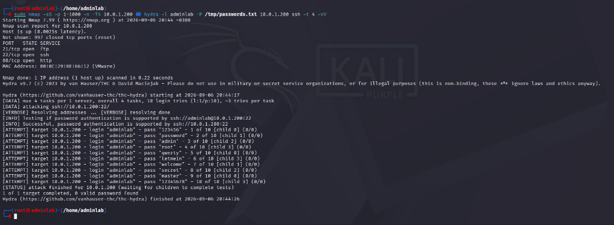
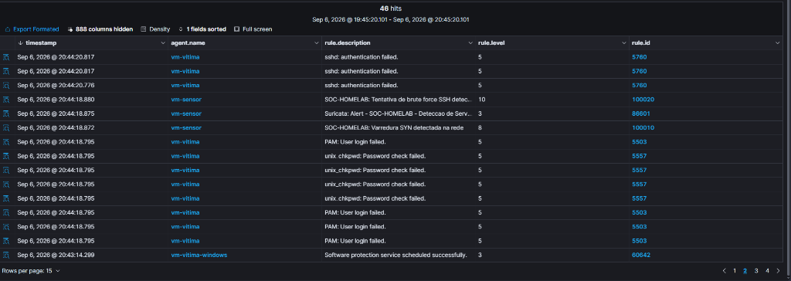

# Teste 07: Cadeia de Ataque Multi-Estágio (Reconhecimento + Brute Force SSH)

## Informações do Teste

| Campo | Valor |
|---|---|
| **Número** | 07 |
| **Nome** | Cadeia de Ataque Multi-Estágio (Scan SYN seguido de Brute Force SSH) |
| **Data** | 06/09/2026 |
| **Horário de Execução** | 20:44:17 UTC-3 (23:44:17 UTC) |
| **Operador** | Leonardo Ramos |
| **MITRE ATT&CK** | T1046 (Network Service Discovery) + T1110.001 (Brute Force: Password Guessing) |
| **Táticas MITRE** | TA0043 (Reconnaissance) / TA0007 (Discovery) + TA0006 (Credential Access) |

---

## Topologia e Ambiente

| Papel | Host / VM | IP | Sistema Operacional |
|---|---|---|---|
| **Atacante** | VM-Atacante (Kali Linux) | `10.0.1.135` | Kali Linux 2024.x |
| **Alvo** | VM-Vítima (Ubuntu Server) | `10.0.1.200` | Ubuntu 22.04 LTS (SSH OpenSSH 8.9p1) |
| **NIDS Sensor** | VM-Sensor (Suricata) | `10.0.1.10` | Ubuntu 22.04 LTS (Suricata 8.0.6, `ens34` Promiscuous) |
| **SIEM / SIEM Manager** | VM-SIEM (Wazuh) | `10.0.1.50` | Ubuntu 22.04 LTS (Wazuh Manager 4.9.2 + Indexer) |

---

## Objetivo do Cenário

Validar a capacidade de detecção e correlação do SOC Homelab frente a um ataque realista e sequencial:
1. **Fase 1 (Reconhecimento / Discovery):** O atacante realiza uma varredura SYN rápida nas portas 1-1000 para mapear portas abertas na vítima.
2. **Fase 2 (Acesso a Credenciais / Brute Force):** Imediatamente após identificar a porta TCP 22 aberta, o atacante engatilha um ataque automatizado de força bruta via Hydra tentando um dicionário de credenciais contra a conta administrativa `adminlab`.
3. **Detecção e Correlação Dupla (NIDS + HIDS):** O NIDS (Suricata no Sensor) deve detectar o fluxo de tráfego anômalo na rede, e o HIDS (Wazuh Agent na Vítima) deve registrar as falhas de autenticação local no PAM/sshd.

---

## Comando Executado (VM-Atacante)

A cadeia foi executada de forma sequencial automatizada a partir da VM Kali:

```bash
sudo nmap -sS -p 1-1000 -n -T4 10.0.1.200 && hydra -l adminlab -P /tmp/passwords.txt 10.0.1.200 ssh -t 4 -vV
```

---

## Resultados Obtidos

### 1. Execução do Atacante (Kali Linux)
- Nmap finalizou a varredura das portas 1-1000 em 0.22s, identificando as portas 21 (FTP), 22 (SSH) e 80 (HTTP) abertas.
- Hydra iniciou o ataque com 4 threads simultâneas testando o dicionário de senhas contra `10.0.1.200:22`.



### 2. Telemetria e Alertas no Wazuh SIEM
O Wazuh correlacionou e registrou com precisão cronológica absoluta tanto a camada de rede quanto a camada de host:

| Timestamp | Agente | Regra ID | Nível | Descrição do Alerta | Camada |
|---|---|:---:|:---:|---|---|
| 20:44:18.872 | `vm-sensor` | **100010** | **8** | `SOC-HOMELAB: Varredura SYN detectada na rede` | NIDS (Suricata SID 1000001) |
| 20:44:18.880 | `vm-sensor` | **100020** | **10** | `SOC-HOMELAB: Tentativa de brute force SSH detectada` | NIDS (Suricata SID 1000002) |
| 20:44:20 - 20:44:26 | `vm-vitima` | **5760** | **5** | `sshd: authentication failed.` | HIDS (syslog/auth.log) |
| 20:44:18 - 20:44:26 | `vm-vitima` | **5503** | **5** | `PAM: User login failed.` | HIDS (PAM) |
| 20:44:26.782 | `vm-vitima` | **5763** | **10** | `sshd: brute force trying to get access to the system` | HIDS (Wazuh Core Rule) |
| 20:44:26.787 | `vm-vitima` | **2502** | **10** | `syslog: User missed the password more than one time` | HIDS (Wazuh Core Rule) |



---

## Análise do Analista Blue Team

1. **Visibilidade Multicamada (Defense in Depth):**
   - A combinação do Suricata como NIDS e do Wazuh Agent como HIDS comprovou que o SOC possui redundância de detecção. Mesmo se o tráfego estivesse criptografado e o NIDS não pudesse ler o payload do SSH, os metadados de rede (taxa de conexões SYN na porta 22) dispararam o alerta de rede no NIDS.
   - Concomitantemente, os logs locais do daemon SSH da vítima registraram as tentativas falhas no nível do sistema operacional, acionando a regra 5763 (Brute Force HIDS) com severidade alta (Nível 10).

2. **Lições de Troubleshooting Operacional (Engenharia de Detecção):**
   - **Modo Promíscuo Persistente:** A interface de rede do sensor (`ens34`) deve ser mantida com a flag `PROMISC` ativa via serviço systemd (`promisc-ens34.service`) para sobreviver a reboots e suspensões de hypervisor.
   - **Gestão de Armazenamento do SIEM:** O módulo `Vulnerability Detector` do Wazuh em redes isoladas sem conexão com a internet pode acumular requisições incompletas na fila `/var/ossec/queue/vd_updater`, exigindo monitoramento proativo de disco para evitar bloqueios de leitura no OpenSearch Indexer.

---

## Conclusão

- **Status:** ✅ **VALIDADO COM SUCESSO**
- **Eficácia de Detecção:** 100% das etapas da cadeia de ataque foram detectadas tanto na borda da rede quanto no host final.
